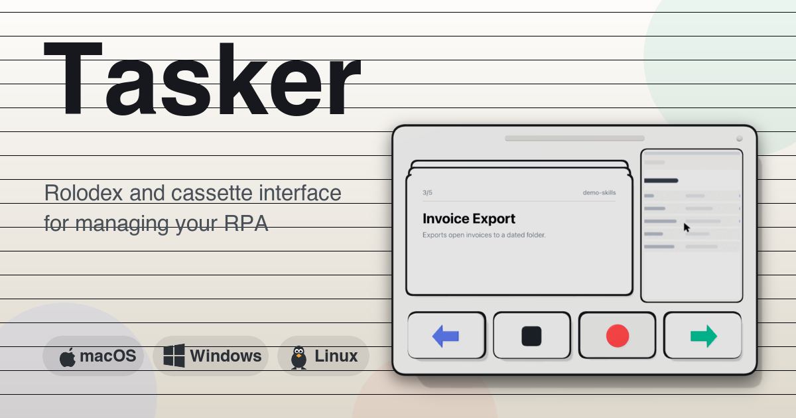
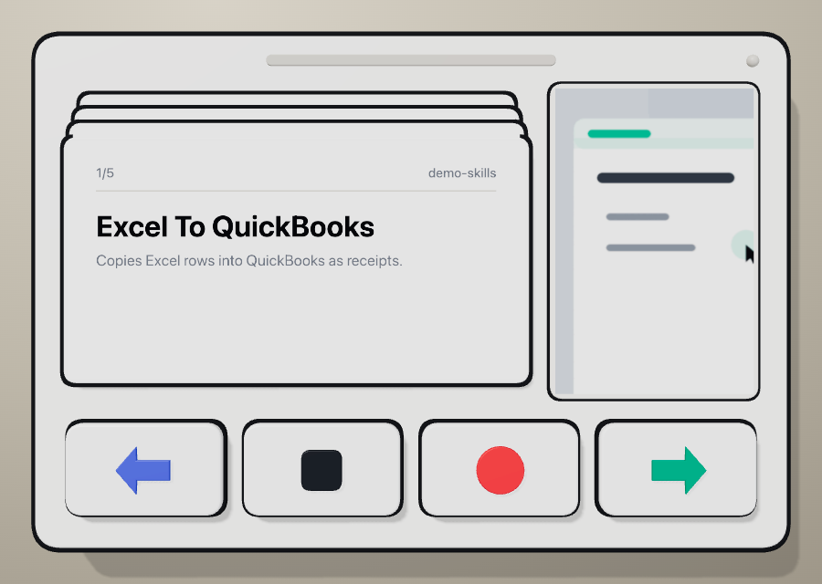
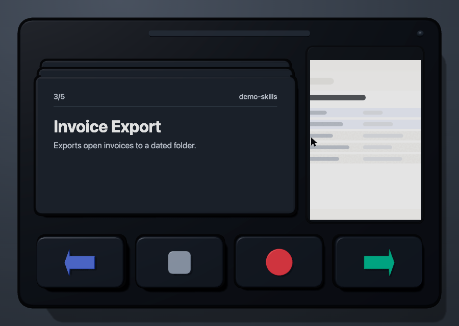
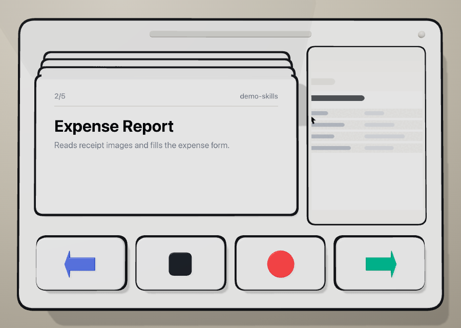
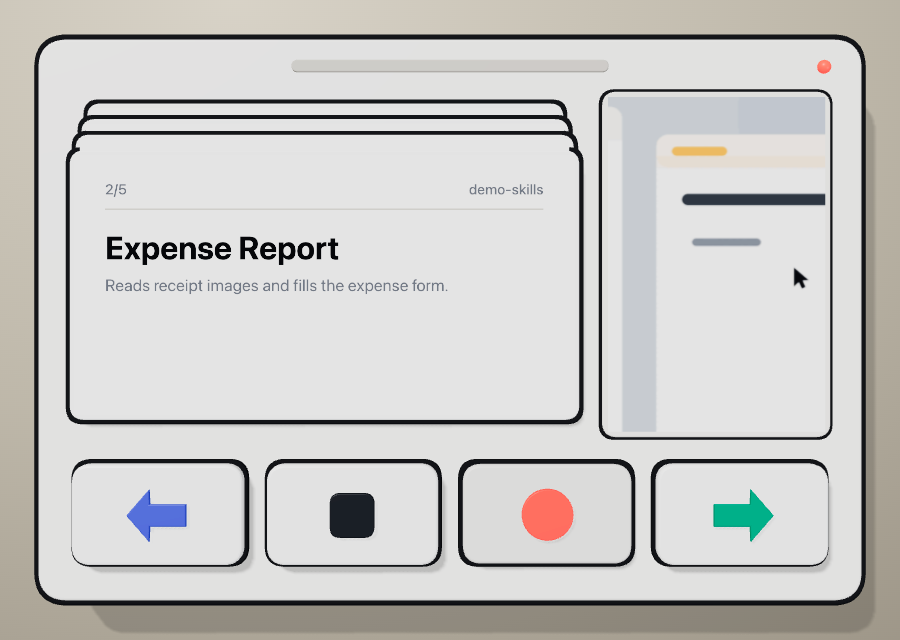

<p align="center">
  
</p>

<h1 align="center">Tasker</h1>

<p align="center">A desktop widget that plays and records Claude skills.</p>

<p align="center">
  <a href="https://github.com/thyfriendlyfox/tasker/actions/workflows/ci.yml"></a>
  <a href="LICENSE"></a>
  
</p>

---

Tasker holds two parts in one small window.
The top part is a rolodex of skill cards with animated previews.
The bottom part is a transport deck with four keys: undo, stop, record and play.
The window floats above other windows. You drag the window. A keyboard shortcut shows and hides it.

Claude Cowork records a skill from a screen recording.
Claude writes the skill to a folder with a `SKILL.md` file.
Tasker reads those folders and gives the skills a physical control surface.

## Screenshots

| Light                                                             | Dark                                                            |
| ----------------------------------------------------------------- | --------------------------------------------------------------- |
|  |  |

| Card turn                                                                 | Record state                                                                           |
| ------------------------------------------------------------------------- | -------------------------------------------------------------------------------------- |
|  |  |

## Features

- Rolodex of skills. One card for each skill. The card shows the name, the description and the source.
- Animated preview for each skill. Tasker plays GIF, MP4, WebM and static image files.
- Transport deck with four keys: undo, stop, record and play.
- Real 3D surface. Three.js builds the parts with lights, shadows and key travel.
- Light theme and dark theme. Tasker follows the system setting.
- Global shortcut. The default shortcut is `Command+Shift+Space` on macOS and `Control+Shift+Space` on Windows and Linux.
- Tray icon with a menu.
- File watcher. New skills appear without a restart.
- Run journal. Tasker writes each action to a file. The undo key acts on the last entry.
- Four adapters. You choose how the keys act on your system.
- No network calls at run time. No telemetry.

## Status

Version 0.1.0. The table shows the state of each part.

| Part                                   | State                                                                                                                                                       |
| -------------------------------------- | ----------------------------------------------------------------------------------------------------------------------------------------------------------- |
| Rolodex, preview panel, transport deck | Works. The screenshots come from the application itself.                                                                                                    |
| Skill discovery and file watcher       | Works. Unit tests and an integration test cover both.                                                                                                       |
| `dry-run`, `command`, `cli` adapters   | Works. The integration test starts real programs and reads the journal file.                                                                                |
| `desktop` adapter                      | The command builder has tests. Nobody tested the key sequence against the Claude desktop application. The default record sequence `cmd+shift+r` is a guess. |
| macOS package                          | Built with electron-builder and started.                                                                                                                    |
| Windows package, Linux package         | The build files exist. Nobody ran these builds yet.                                                                                                         |
| Code signing, notarization             | Not set up. The workflow reads the secrets when you add them.                                                                                               |
| `confirmBeforeRun`                     | Reserved. The field does nothing today.                                                                                                                     |
| `assets/demo-skills`                   | Sample data. A script draws these recordings. They are not recordings of real software.                                                                     |

Set `adapter.keys.record` to the sequence that your version of the Claude desktop application uses.

## Install

Download an installer from the [releases page](https://github.com/thyfriendlyfox/tasker/releases).

| Platform | File                                                       |
| -------- | ---------------------------------------------------------- |
| macOS    | `Tasker-<version>-arm64.dmg` or `Tasker-<version>-x64.dmg` |
| Windows  | `Tasker-<version>-x64-setup.exe`                           |
| Linux    | `Tasker-<version>-x86_64.AppImage`, `.deb` or `.rpm`       |

The macOS and Windows builds are not signed yet.
macOS shows a warning for an unsigned application.
Open the application from the context menu of Finder to accept it.

### Build from source

```bash
git clone https://github.com/thyfriendlyfox/tasker.git && cd tasker && pnpm install && pnpm run dev
```

Node 20.19 or later and pnpm 11 or later are required.
Run `corepack enable pnpm` to install pnpm.

## Use

### Mouse

| Action                             | Result                                   |
| ---------------------------------- | ---------------------------------------- |
| Click a key                        | Tasker runs the action of the key.       |
| Click the front card               | Tasker plays the skill of the card.      |
| Click a card behind the front card | The rolodex turns to that card.          |
| Double click a card                | The file manager opens the skill folder. |
| Scroll over the rolodex            | The rolodex turns.                       |
| Drag the grip or the window border | The window moves.                        |

### Keyboard

| Key                   | Result                     |
| --------------------- | -------------------------- |
| `Right` or `Down`     | Turn to the next card.     |
| `Left` or `Up`        | Turn to the previous card. |
| `Enter` or `Space`    | Play the skill.            |
| `R`                   | Record a skill.            |
| `S`                   | Stop the action.           |
| `U` or `Backspace`    | Undo the last run.         |
| `Command/Control + Z` | Undo the last run.         |
| `Command/Control + O` | Open the skill folder.     |
| `Escape`              | Hide the window.           |
| `Command/Control + W` | Hide the window.           |

The global shortcut shows and hides the window from any application.
Set the shortcut in the configuration file.

## Skills

A skill is one folder with a `SKILL.md` file.
Tasker reads the YAML frontmatter of that file.

```markdown
---
name: Excel To QuickBooks
description: Copies Excel rows into QuickBooks as receipts.
tags: [finance, data entry]
preview: preview.gif
---

# Excel To QuickBooks

1. Open the source file.
2. Read each row.
3. Open QuickBooks.
4. Enter the row values.
```

| Field           | Use                                                             |
| --------------- | --------------------------------------------------------------- |
| `name`          | Card title. The folder name is the default.                     |
| `description`   | Card text.                                                      |
| `tags`          | Card metadata.                                                  |
| `preview`       | Preview file in the skill folder.                               |
| `previewZoom`   | Zoom of the preview, from 1 to 6. The default follows the size. |
| `previewFollow` | Set the value to `false` to hold the preview at the center.     |
| `previewLoop`   | `pingpong` or `forward`. The default is `pingpong`.             |

Tasker also finds a preview file without the `preview` field.
The file name must start with `preview`, `demo`, `recording` or `thumbnail`.

### Preview crop

A screen recording is wide. The preview panel is small and upright.
Tasker therefore shows one part of the recording.

1. Tasker finds the strongest point of change in each frame. That point is the pointer.
2. Tasker smooths the path of that point.
3. Tasker cuts an upright frame around the point and fills the panel with it.

The result is a zoomed recording that follows the pointer.
Set `previewFollow: false` to hold the crop at the center of the screen.

Tasker plays the frames forward, then backward.
The pointer therefore returns to the start of the recording, and the loop holds no jump.
Set `previewLoop: forward` for a plain loop.

Tasker reads these folders by default:

| Platform | Folders                                                                                    |
| -------- | ------------------------------------------------------------------------------------------ |
| macOS    | `~/.claude/skills`, `~/.claude/plugins`, `~/Library/Application Support/Claude/skills`     |
| Windows  | `%USERPROFILE%\.claude\skills`, `%USERPROFILE%\.claude\plugins`, `%APPDATA%\Claude\skills` |
| Linux    | `~/.claude/skills`, `~/.claude/plugins`, `~/.config/Claude/skills`                         |

Add more folders with the `skillRoots` field of the configuration file.

## Adapters

The Claude desktop application has no public control interface.
Tasker therefore sends each transport action through an adapter.
You select the adapter in the configuration file.

| Adapter   | Action                                                  | Note                                                                    |
| --------- | ------------------------------------------------------- | ----------------------------------------------------------------------- |
| `dry-run` | Writes the action to the journal.                       | This adapter is the default. Tasker never acts before you configure it. |
| `command` | Starts a program that you define for each key.          | This adapter gives full control.                                        |
| `cli`     | Sends a prompt to the `claude` command line interface.  | The play key and the undo key work.                                     |
| `desktop` | Sends a key sequence to the Claude desktop application. | macOS needs accessibility permission. Linux needs `xdotool`.            |

Tasker starts each program directly. No shell reads the arguments.

Read [docs/ADAPTERS.md](docs/ADAPTERS.md) for the full description.

## Configuration

The configuration file is JSON. Open the file from the tray menu.

| Platform | Path                                               |
| -------- | -------------------------------------------------- |
| macOS    | `~/Library/Application Support/Tasker/config.json` |
| Windows  | `%APPDATA%\Tasker\config.json`                     |
| Linux    | `~/.config/Tasker/config.json`                     |

```json
{
  "skillRoots": ["/Users/me/.claude/skills"],
  "shortcut": "Command+Shift+Space",
  "theme": "system",
  "window": { "width": 460, "height": 320, "alwaysOnTop": true, "hideOnBlur": false },
  "adapter": {
    "id": "command",
    "commands": {
      "play": { "program": "claude", "args": ["-p", "Use the ${skillName} skill."] },
      "record": { "program": "open", "args": ["-a", "Claude"] }
    }
  }
}
```

Read [docs/CONFIGURATION.md](docs/CONFIGURATION.md) for each field.

## Use cases

| Case                 | Record                                                     | Play                                           |
| -------------------- | ---------------------------------------------------------- | ---------------------------------------------- |
| **Accounts payable** | Copy one week of Excel rows into QuickBooks as receipts.   | Run the same import each Monday.               |
| **Invoice export**   | Export open invoices to a dated folder.                    | Repeat the export at the end of each month.    |
| **Lead handoff**     | Move a new form entry into the CRM with the correct owner. | Run the move for each new lead.                |
| **Ticket triage**    | Sort new tickets by product area and priority.             | Clear the queue each morning.                  |
| **Expense reports**  | Read receipt images and fill the expense form.             | Process a folder of receipts in one run.       |
| **Onboarding**       | Create the accounts of a new colleague in four systems.    | Repeat the steps for the next colleague.       |
| **Data migration**   | Move records from an old tool to a new tool.               | Run the migration for each batch.              |
| **Report assembly**  | Collect numbers from three dashboards into one document.   | Rebuild the report each week.                  |
| **Quality checks**   | Compare a shipment list against the order system.          | Check each shipment file.                      |
| **Demonstration**    | Record a product walkthrough one time.                     | Replay the walkthrough for each customer call. |

The rolodex holds the skills of a whole team.
One card and four keys replace a long prompt.

## Development

```bash
pnpm install
pnpm run dev
```

| Command                     | Result                                                                            |
| --------------------------- | --------------------------------------------------------------------------------- |
| `pnpm run dev`              | Start the application with hot reload.                                            |
| `pnpm run build`            | Check the types and build to `out/`.                                              |
| `pnpm test`                 | Run the unit tests.                                                               |
| `pnpm run test:integration` | Run the run path in Electron against real processes.                              |
| `pnpm run lint`             | Run ESLint.                                                                       |
| `pnpm run typecheck`        | Run the TypeScript compiler.                                                      |
| `pnpm run assets`           | Rebuild the icons, the demo skills, the models, the screenshots and the OG image. |
| `pnpm run pack`             | Build an unpacked application in `release/`.                                      |
| `pnpm run dist`             | Build the installers for the current platform.                                    |

The project uses pnpm. The file `pnpm-workspace.yaml` allows the install scripts of
`electron` and `esbuild`. Both packages download a platform binary.
The file `.npmrc` sets `node-linker=hoisted` because electron-builder needs a flat module folder.

Read [docs/ARCHITECTURE.md](docs/ARCHITECTURE.md) for the structure of the code.

## Assets

`pnpm run assets` builds every asset from code. No binary source file is edited by hand.

| Output                                              | Source                           |
| --------------------------------------------------- | -------------------------------- |
| `build/icon.icns`, `build/icon.ico`, `build/icons/` | `scripts/make-icons.mjs`         |
| `assets/demo-skills/`                               | `scripts/make-demo-previews.mjs` |
| `assets/models/*.glb`                               | `scripts/export-models.mjs`      |
| `assets/screenshots/`, `assets/og-image.png`        | `scripts/capture.mjs`            |

The screenshots come from the real application through `webContents.capturePage()`.
The 3D models use the same shapes as the application.
Open the models in any glTF viewer.

The folder `assets/logos` holds the platform marks for the OG image.
Each mark belongs to its owner. The OG image shows the marks to name the supported systems.

## Security and privacy

- Tasker makes no network call at run time.
- Tasker collects no data.
- The renderer runs with `contextIsolation`, `sandbox` and a content security policy.
- The preload bridge exposes a fixed list of functions.
- The asset protocol serves files from the skill folders only.
- Tasker starts a program only after you configure an adapter.

Report a security problem through [SECURITY.md](SECURITY.md).

## License

MIT. See [LICENSE](LICENSE).
